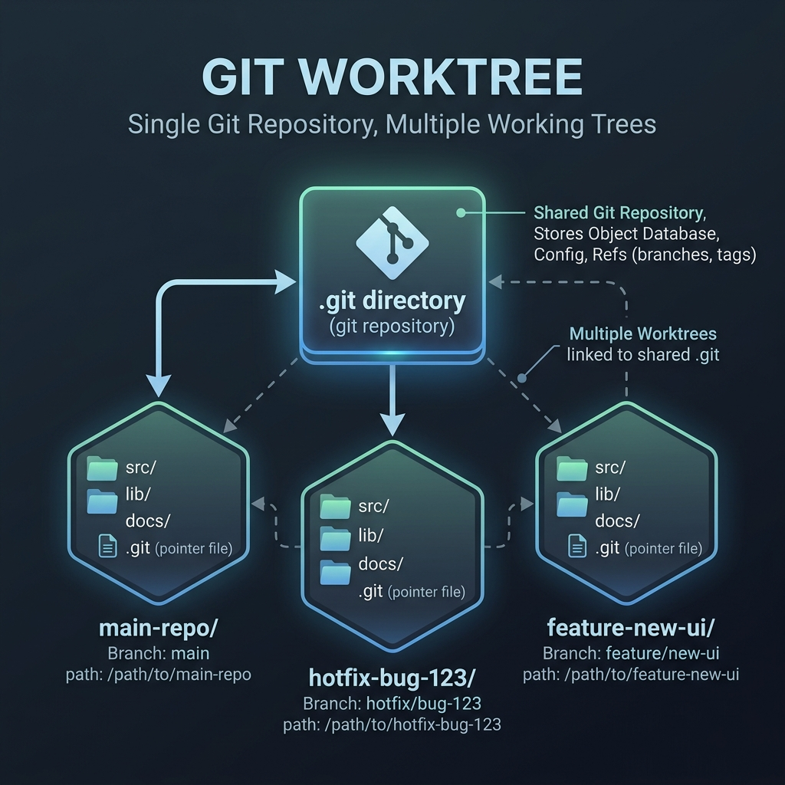

Have you ever found yourself deep in a feature branch, with multiple uncommitted changes, only to be interrupted by a critical bug report on `main`? 

Traditionally, you had two choices:
1. **Stash and Switch:** Run `git stash`, switch branches, fix the bug, commit, switch back, and run `git stash pop`. This context-switching can disrupt your focus and break active local builds.
2. **Clone Again:** Clone the repository to another folder entirely. This wastes disk space and time, duplication of the object database, and leaves you managing separate local repositories.

Fortunately, Git provides a third, elegant solution: **`git worktree`**. This feature allows you to attach multiple working directories (worktrees) to a single local repository, allowing you to checkout and work on different branches concurrently.

---

## Git Branch vs. Git Worktree

Here is how Git Worktree stacks up against standard branch switching and multiple repository clones:

| Feature | Standard Git Branch (Single Checkout) | Git Worktree (Multiple Checkouts) | Multiple Clones |
| :--- | :--- | :--- | :--- |
| **Active Branches** | Only **one** branch can be checked out at a time. | **Multiple** branches checked out simultaneously in different folders. | **Multiple** branches in different folders. |
| **Git Database (`.git`)** | Shared single instance. | **Shared single instance** (all worktrees point to the same main `.git` database). | Independent copies (disjoint history and refs, duplicates database). |
| **Disk Space** | Minimal. | **Minimal** (only checks out the files needed for each directory). | High (each clone duplicates the object database). |
| **Local Stashing Required** | Yes, if you have uncommitted work. | **No**; just open a new folder for the hotfix while keeping your feature work in progress. | No. |
| **Best For** | Sequential task progression. | **Concurrent tasks** (e.g., hotfixes, reviewing PRs, running tests in background). | Separate forks or independent repos. |

---

## How Git Worktree Works

Rather than duplicating the entire Git history and configuration, `git worktree` sets up a main repository with additional linked checkouts. Each worktree directory contains its own files and a special `.git` file that points back to the main repository's `.git` database.



---

## Hands-On: Working with a Mock Repo

Let's walk through a complete, hands-on workflow to see `git worktree` in action.

### Step 1: Create a Mock Repository
First, we will set up a main repository with an initial commit:

```bash
# Create and initialize the project
mkdir my-project
cd my-project
git init

# Add a README and commit
echo "# My Awesome Project" > README.md
git add README.md
git commit -m "Initial commit"
```

### Step 2: Work on a Feature Branch
Let's start working on a new feature branch `feature/cool-stuff`:

```bash
git checkout -b feature/cool-stuff
echo "Adding a cool feature..." > feature.txt
git add feature.txt
git commit -m 'added file feature.txt'
# make some new changes
echo "Adding new lines to feature.txt" >> feature.txt
# (Leave feature.txt uncommitted or unstaged, you will get error)
```

### Step 3: Switch to a Hotfix using a Worktree
Suddenly, a critical bug is reported in `main`. Instead of stashing our uncommitted work in `feature/cool-stuff`, we can create a new worktree directory `../my-project-hotfix` specifically for the hotfix:

```bash
# Create a new worktree and check it out to a new branch 'hotfix/bug-123' based on 'main'
git worktree add -b hotfix/bug-123 ../my-project-hotfix main
```

This creates a new folder `my-project-hotfix` outside of your current folder. Git automatically sets up the files, pointing them back to your main database.

### Step 4: Fix the Bug in the Worktree
Navigate to your newly created hotfix directory and apply the fix:

```bash
cd ../my-project-hotfix

# Apply the fix and commit it
echo "Fixing critical issue..." > hotfix.txt
git add hotfix.txt
git commit -m "Fix critical production issue"
```

Because your feature work remains in `my-project`, it is completely untouched!

### Step 5: Verify the Worktree Structure
Go back to your main repository directory to view the list of active worktrees:

```bash
cd ../my-project
git worktree list
```

This command will list all active directories linked to the repository:

```text
/path/to/my-project          <commit-hash> [feature/cool-stuff]
/path/to/my-project-hotfix   <commit-hash> [hotfix/bug-123]
```

### Step 6: Cleaning Up

Once you are done with the hotfix (e.g., after pushing it or merging it to `main`), you can safely remove the worktree folder.

Now let's merge the hotfix back into `main`:

```bash
# In the hotfix worktree
git checkout main
git merge hotfix/bug-123
git push origin main # optional
```

In modern versions of Git, you can remove the worktree cleanly with:

```bash
git worktree remove ../my-project-hotfix
```

Alternatively, you can manually delete the folder and prune the references:

```bash
rm -rf ../my-project-hotfix
git worktree prune
```

---

## Quick Reference Commands

Here are the most common `git worktree` commands:

| Command | Description |
| :--- | :--- |
| `git worktree add <path> <branch>` | Create a new worktree at `<path>` checking out `<branch>`. |
| `git worktree add -b <new-branch> <path> <base-branch>` | Create a new worktree at `<path>` with a new branch `<new-branch>` tracking `<base-branch>`. |
| `git worktree list` | List all active worktrees linked to the repository. |
| `git worktree remove <path>` | Remove a worktree directory and clean up its references. |
| `git worktree prune` | Clean up worktree information for directories that were deleted manually. |

Using `git worktree` keeps your workspace clean, speeds up switching between context, and optimizes your machine's disk space. Give it a try on your next context switch!
